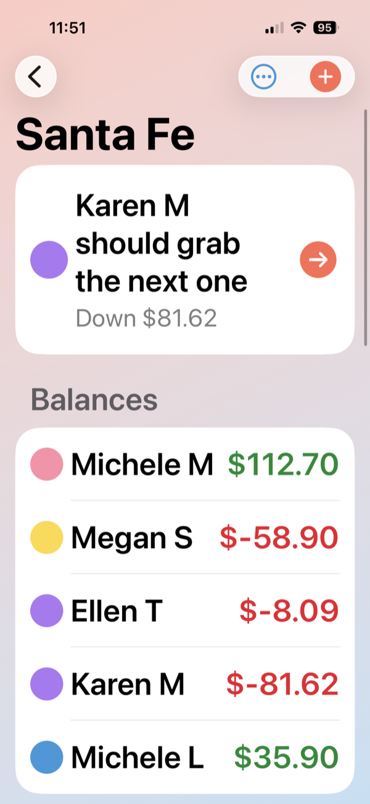
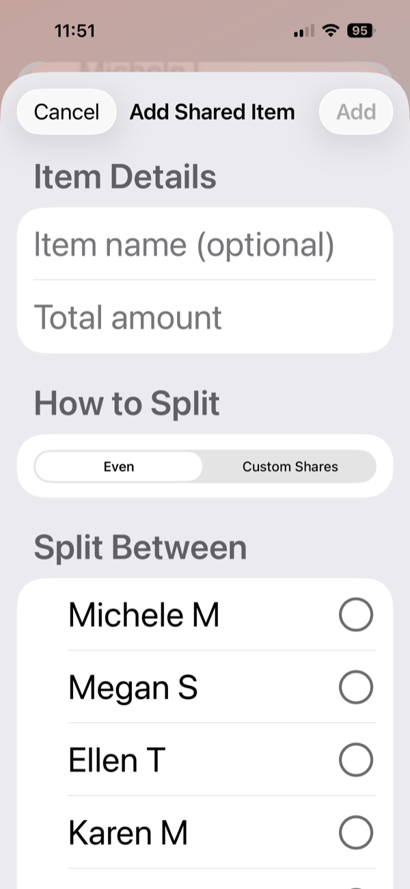

<div align="center">
  
  <h1>TripSplit</h1>
  <p><em>A native iOS app for splitting shared trip expenses and settling up with the fewest possible payments.</em></p>
</div>

---

TripSplit helps a group track who paid for what on a trip, handles flexible ways
to split each expense, and then computes the **minimum set of transfers** needed
to settle everyone up — so instead of a tangle of "you owe me, I owe them," you
get a short list of "pay X $40, pay Y $15."

> Built as a personal project to round out a portfolio that otherwise lives in
> other domains — it's the "ship a real, native mobile app end-to-end" exhibit.

## Highlights

Two things set TripSplit apart from a typical "split the bill evenly" app:

<table>
<tr>
<td width="50%" valign="top">

**🧮 Minimal-transfer settlement**

Most apps just tell you everyone's balance. TripSplit runs a graph-based
algorithm to collapse all the IOUs into the **fewest payments** that settle
the group — and surfaces *who should grab the next expense* to keep things
even as the trip goes.

</td>
<td width="50%" valign="top">

**🔀 Per-item custom-share splitting**

Splitting isn't just even-vs-itemized. Any **shared item** can be divided by
**custom shares** (e.g. one person had two drinks), not just split equally —
a level of granularity most expense-splitters don't offer.

</td>
</tr>
<tr>
<td align="center"></td>
<td align="center"></td>
</tr>
</table>

## Features

- **Trips & participants** — create trips, add people (with color identities), rename trips, and remove participants who aren't yet tied to any expense.
- **Flexible expense splitting** — three strategies per expense:
  - **Even** — split equally across participants
  - **Shares** — ratio-based splitting (e.g. 2:1:1)
  - **Itemized** — per-person line items, plus *shared items* that can themselves be split evenly or by custom shares
- **Smart settlement** — a graph-based algorithm reduces all the back-and-forth to the fewest payments that zero everyone out.
- **"Who's up next"** — surfaces the person most in the red so the group can keep balances even as they go.
- **Receipt capture** — attach a photo to any expense, stored directly on the record.
- **PDF trip report** — generate and share a formatted summary of the trip.
- **Friends directory** — a reusable contact list so the same people carry their name and color across trips.

## Tech Stack

| | |
|---|---|
| **Language** | Swift 5 |
| **UI** | SwiftUI |
| **Persistence** | SwiftData (`@Model`, `@Query`, cascade/nullify delete rules) |
| **Min iOS** | 26.2 |
| **Dependencies** | None — pure first-party frameworks |

## Architecture

No ViewModel layer — views talk to SwiftData directly via `@Environment(\.modelContext)`
for writes and `@Query` for reactive reads, with `@State` for local UI. The whole
project runs with `SWIFT_DEFAULT_ACTOR_ISOLATION = MainActor`, so model mutations
are main-actor by default.

**Data model** (`Models.swift`):

```
Trip ── participants ──▶ Person ──▶ (lineItems, sharedItems, friend)
  ├── expenses ────────▶ Expense ──▶ (shares, sharedItems, receipt)
  └── paymentRecords ──▶ PaymentRecord
```

Cascade-delete rules mean deleting a `Trip` cleans up all of its children, while
participant removal is guarded so you can only delete someone with no expense
involvement (payer, share, line item, or shared item) — keeping balances
consistent.

**Navigation:**

```
TripListView → TripDetailView → ExpenseDetailView
                              → SettlementView
                              → AddExpenseView (sheet)
                              → AddPersonToTripView (sheet)
```

**Key files:**

| File | Purpose |
|------|---------|
| `Models.swift` | All SwiftData models and balance/domain logic |
| `AddExpenseView.swift` / `EditExpenseView.swift` | Expense creation & editing with split-type selection |
| `LineItemSheets.swift` | UI for itemized line items and shared items |
| `SettlementView.swift` | Balance calculation and minimal-transfer payment optimization |
| `TripReportGenerator.swift` | PDF report generation |
| `ColorTheme.swift` | Centralized sunset/ocean palette |

## Build & Run

```bash
# Open in Xcode (primary workflow)
open TripSplitApp.xcodeproj

# Or build from the command line
xcodebuild -project TripSplitApp.xcodeproj -scheme TripSplitApp \
  -destination 'platform=iOS Simulator,name=iPhone 17' build
```

Requires an iOS 26.2 simulator or device. No package resolution or extra
setup — clone and run.

## License

[MIT](LICENSE) © 2026 Megan Schott
